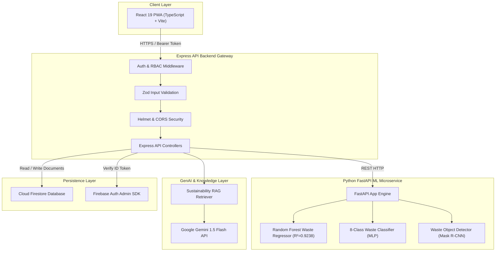

# 🏗️ EcoSetu AI — System Architecture & Topology Guide

This document presents the software architecture, component topology, multi-tier security model, ML microservice pipeline, and data flow specifications for **EcoSetu AI**.

---

## 1. High-Level System Architecture Diagram



---

## 2. Multi-Tier Security Architecture

1. **Authentication Layer**
   - **Frontend**: Obtains Firebase ID token upon user login (`signInWithPopup` / `signInWithEmailAndPassword`) and attaches token in `Authorization: Bearer <token>` headers.
   - **Backend**: Verifies ID tokens cryptographically using Firebase Admin SDK (`verifyIdToken(token, true)`).
   - **Demo Auth Isolation**: Demo mode credentials (`ENABLE_DEMO_AUTH`) are strictly restricted to development environments and rejected in production.

2. **Authorization & RBAC Layer**
   - Role-based middleware (`requireRole(['ORGANIZER', 'RECOVERY_PARTNER', 'ADMIN'])`) verifies permissions server-side before executing request controllers.
   - Multi-tenant organization isolation (`authorizeResourceAccess`) checks resource ownership (`organizerUid` / `partnerUid`).

3. **Input & API Validation Layer**
   - All inbound JSON bodies are validated against strict Zod schemas (`predictWasteSchema`, `createEventSchema`, `recordActualWasteSchema`, `matchPartnerSchema`, `calculateImpactSchema`).

4. **Security Headers & Rate Limiting**
   - OWASP Helmet headers enforce security policies.
   - Centralized rate limiters prevent API spam on sensitive endpoints (`/api/v1/chat`, `/api/v1/waste/predict`).

---

## 3. ML Inference & Feedback Loop Pipeline

```text
Input Request (Event Details / Photo)
             │
             ▼
Express Backend Gateway
             │
             ├──► Image Input ─────► FastAPI Waste Classifier / Detector
             │
             └──► Event Tabular ───► FastAPI Random Forest Regressor
                                             │
                                             ▼
                                  Prediction + Feature Attribution
                                  (Guest 65%, Duration 18%, Food 12%, Decor 5%)
                                             │
                                             ▼
                                  Actual Post-Event Outcomes Recorded
                                             │
                                             ▼
                                  Compute Error Metrics (MAPE)
                                  & Prepare Retraining Dataset
```

---

## 4. Grounded RAG Knowledge Base Architecture

When a user submits a query to the AI Assistant:
1. **Security Scan**: Query checked for prompt injection patterns (`detectPromptInjection`).
2. **RAG Retrieval**: `sustainabilityRAG.ts` computes keyword relevance matching against sustainability knowledge chunks (FSSAI surplus food safety, floral upcycling, dual-stream plastic ban, mass event protocols, pickup logistics).
3. **Prompt Grounding**: Top 3 retrieved knowledge passages and live platform telemetry are injected into Gemini 1.5 Flash system instructions to prevent hallucinations.

---

## 5. EPA WARM v15 Environmental Impact Engine

The impact engine calculates environmental savings based on EPA Waste Reduction Model (WARM) v15 lifecycle standards:

$$\text{CO}_2\text{e Avoided (kg)} = (2.1 \times \text{Food}_{\text{kg}}) + (1.5 \times \text{Plastic}_{\text{kg}}) + (0.9 \times \text{Paper}_{\text{kg}})$$

$$\text{Meals Rescued} = 0.3 \times \text{Food}_{\text{kg}}$$

$$\text{Tree Equivalent} = \frac{\text{CO}_2\text{e}}{21.77}$$

$$\text{Landfill Volume Saved (m}^3\text{)} = \frac{\text{Total}_{\text{kg}}}{500}$$

---

## 6. Pickup Request State Machine Lifecycle (7 Stages)

The pickup state machine guarantees strict, unidirectional state transitions audited by server logs:

```text
[ PENDING ] ─────► [ ACCEPTED ] ─────► [ SCHEDULED ] ─────► [ PICKUP_IN_PROGRESS ]
                                                                     │
[ COMPLETED ] ◄───── [ RECOVERED ] ◄───── [ COLLECTED ] ◄────────────┘
```

**State Machine Transition Invariants:**
1. `PENDING` $\rightarrow$ `ACCEPTED` (Partner accepts request & assigns transport)
2. `ACCEPTED` $\rightarrow$ `SCHEDULED` (Pickup window confirmed with organizer)
3. `SCHEDULED` $\rightarrow$ `PICKUP_IN_PROGRESS` (Logistics vehicle dispatched)
4. `PICKUP_IN_PROGRESS` $\rightarrow$ `COLLECTED` (Waste stream collected on-site)
5. `COLLECTED` $\rightarrow$ `RECOVERED` (Delivered to recycling/composting facility)
6. `RECOVERED` $\rightarrow$ `COMPLETED` (Final weights verified & impact recorded)
7. Any active pre-collection state $\rightarrow$ `CANCELLED` (Terminal abort path)

